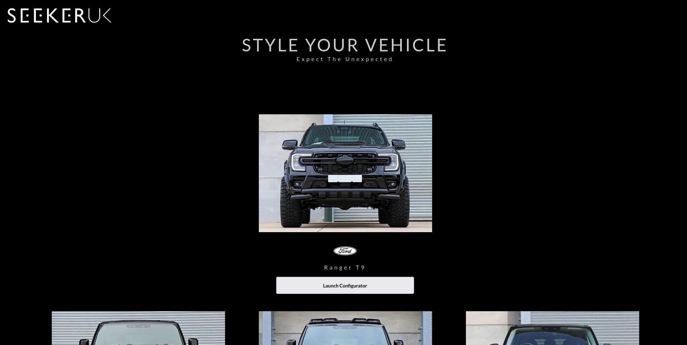
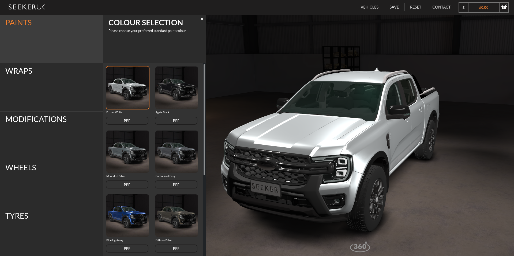

This is a car configuration tool. It allows the user to build custom configurations for vehicles the company
makes, creating a quote for the customer.

I have largely worked on support for this project, transitioning it onto new infrastructure as well as adding new features,
vehicles and bug fixes to improve the user experience.

Check it out [here](https://configurator.seekeruk.com/SeekerUK/index.html).

