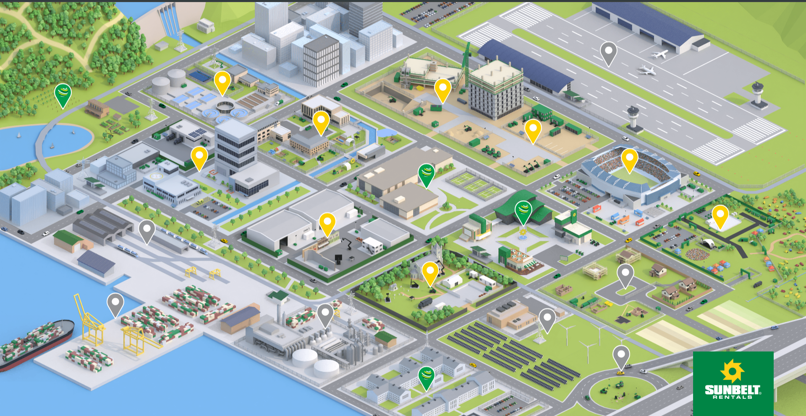

This is a interactive visualisation of Sunbelt Rental's business, allowing users to explore and inspect various things
relating to the business. Users can select different sections and view further details on activities they are involved in,
with videos and links for further information for those interested.

I've supported this project with performance improvements and refactors to better support the rendering pipeline,
as well as implementation of the mobile UI and tooling to improve development productivity.

You can view it [here](https://thecity.sunbeltrentals.co.uk/).

import vid1 from '../../assets/projects/sunbelt/sunbelt_home_video.webm'
import vid2 from '../../assets/projects/sunbelt/sunbelt_video.webm'

<video width="100%" controls autoplay loop muted>
  <source src={vid1} type="video/webm">
  Your browser does not support the video tag.
  </source>
</video>

<video width="100%" controls autoplay loop muted>
  <source src={vid2} type="video/webm">
  Your browser does not support the video tag.
  </source>
</video>
