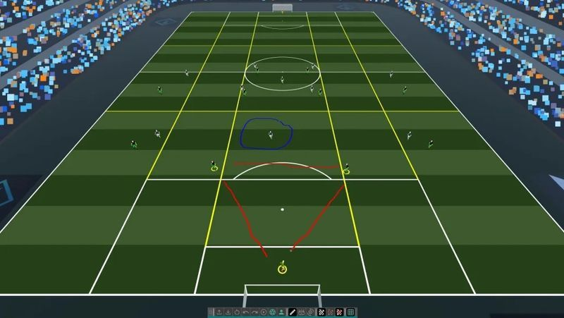
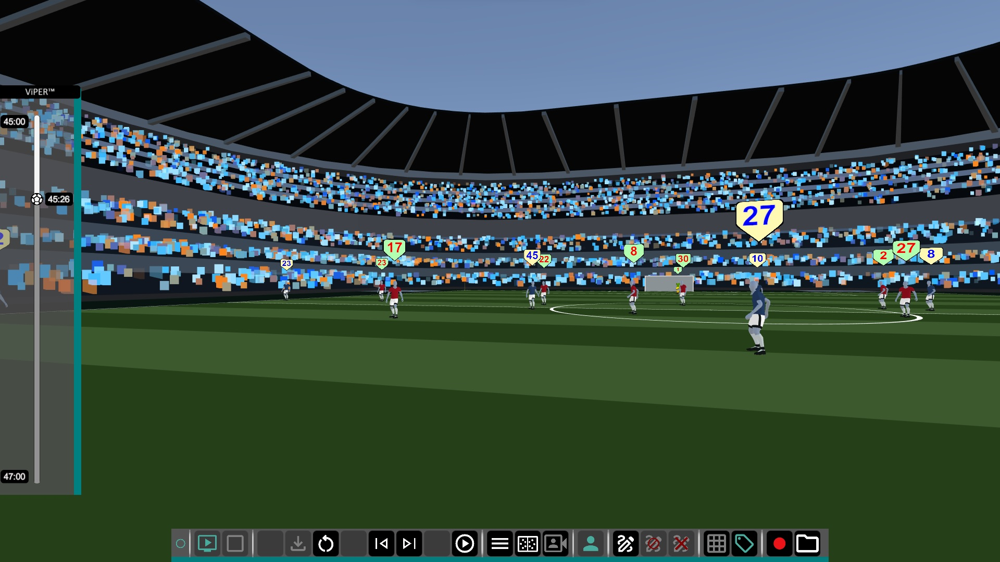

ViPER Coach is a VR oriented system which began as training exercises in VR for collecting data on head tracking to
a multiplayer, VR coaching app that allows you to record, playback and view sequences from games, including the ability
to upload live Opta data from Premier league games to playback using our system.

I worked on the frontend portal, which was used for creating and linking an account with your VR headset for collecting
and comparing data with other users. I also contributed considerable work on the backend, creating new features and bug fixes,
including the implementation for handling uploads and optimisation of how our APIs handled and sent large amounts of data.

The project isn't currently live, but you can check [Future Performance Tech](https://futureperformance.tech/) for updates.

